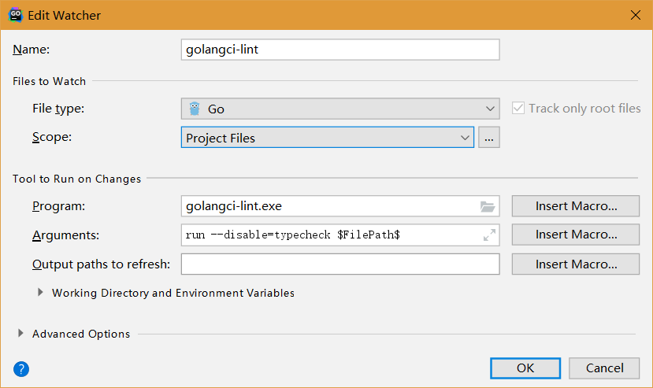

# Getting Started: Smart Contract

In this section, we will experience the deployment of smart contracts to blockchains and make calls with the private chain ``` hello``` that we have set up previously.

## 1. Registering an Organisation

First, we need to use the test account ``` alice``` to register an organization ``` DAO``` for testing on the private chain. The commands are as follows:

``` 
[... pieces]# ./bcc registerOrg -k=wal -n=alice -p=Ab1@Ab1@ -g=500000 -o=DAO
OK
Response: {
  "code": 200,
  "log": "",
  "fee": 1250000000,
  "txHash": "d8466af21e72bb5d56236fc7d5af3fdb0e193fcc34e5dc346d5bc0ef5fc4c945",
  "height": 747,
  "orgID": "orgE37w7wxhZwaox1fhndt5Czm8WnLBrh6db"
}
``` 

Using to the return transaction hash above, you can check the transaction details as shown in the previous section of this document.

The following command can query the organization's details based on the organization ID returned earlier:

``` 
[... pieces]# curl -s http://192.168.2.101:46657/abci_query? path=%22/organization/orgE37w7wxhZwaox1fhndt5Czm8WnLBrh6db%22 | ./jq .result.response.value | tr -d "\"" | base64 -d
{
  "orgID":"orgE37w7wxhZwaox1fhndt5Czm8WnLBrh6db",
  "name":"DAO",
  "orgOwner":"hello9A8BiLaA3nHK3upwCZ3aTztRGFbFMW82b",
  "contractAddrList":[],
  "orgCodeHash":null,
  "signers":[]
}
``` 

We can see that the newly registered organization has not yet deployed a smart contract and has not yet specified the signer of the smart contract.

Next we need to authorize ``` alice``` as the smart contract signer of the ``` DAO``` organization using the ``` DAO``` organization registrant's account:

``` 
[... pieces]# ./bcc setOrgSigners -k=wal -n=alice -p=Ab1@Ab1@ -g=500000 -o=DAO -s=[\"0xe5b95784049c3b8669aa58ba08abd9f54281df8905dd3af24bf795b0103f9ec7\"]
OK
Response: {
  "code": 200,
  "log": "",
  "fee": 1250000000,
  "txHash": "30f084f912d1360d958b9e057ff326dc08bf9d402863a66c60e2f8e683697266",
  "height": 774
}
``` 

Next we need to authorize ``` alice``` as the deployer of the ``` DAO``` organization's smart contract with the account of the private chain ``` hello``` committee:

``` 
[... pieces]# ./bcc setOrgDeployer -k=charter/wal/owner -n=owner -p=Ab1@Ab1@ -g=50000 -o=DAO -d=hello9A8BiLaA3nHK3upwCZ3aTztRGFbFMW82b
OK
Response: {
  "code": 200,
  "log": "",
  "fee": 125000000,
  "txHash": "98bb23e0f0248a04b2db4ff74b1dc10544887fa7673c64caea0b306a270c4a9e",
  "height": 884
}
``` 


## 2. IDE Resource

The following are the source code resources on which the development environment of smart contracts depends:

``` 
git clone https://github.com/bcbchain/thirdparty
git clone https://github.com/bcbchain/sdk
``` 

The following are the development resources for the smart contract development environment:

``` 
GO:     GO 1.11 and above

GoLand: JetBrains GoLand 2018.3.5 and above
        Require BCBChain plugin：sdk/plugin/bcbchain_goland_plugin_x.x.x.x-2018.zip
        The directory thirdparty and sdk need to be set to GOPATH
or
GoLand: JetBrains GoLand 2019.1.2 and above
        Require BCBChain plugin：sdk/plugin/bcbchain_goland_plugin_x.x.x.x-2019.zip
        The directory thirdparty and sdk need to be set to GOPATH 
``` 


## 3. IDE Configuration

It is strongly recommended to use the following code and programming style configuration when using ``` GoLand IDE```.

It is strongly recommended to configure ``` GoLand IDE``` to automatically format and statically analyze code when files change.

This section describes the typical IDE configuration.

**GOPATH**

``` 
File
    >> Settings
        >> GO
            >> GOPATH
                >> append directory 'thirdparty' and 'sdk' to Global GOPATH
                >> or append directory 'thirdparty' and 'sdk' to Project GOPATH
``` 


**Code Formatting and Static Analysis**:

``` 
File 
    >> Settings 
        >> Tools 
            >> File Watchers
                >> add and select 'go fmt'
                >> add and select 'goimports'
                >> add and select 'golangci-lint'
``` 


 ``` go fmt``` is a tool taht comes with ``` golang``` 


 ``` goimports``` is a open source third-party tool that optimizing the format of imported packages in code. The configuration is (for Windows)：


 ``` golangci-lint``` is a open source third-party tool for static analysis of code. The configuration is (for Windows)：



The third-party package provided by BCBChain ``` SDK``` already contains the source code and installation scripts of these tools (the resources are packaged in the ``` tools``` directory).


**Tabs and code indentation**

``` 
File 
    >> Settings 
        >> Editor 
            >> Code Style
                >> Go
                    >> Tabs and Indents
                        >> Select 'Use tab character'
                        >> De-select everything else
``` 


**import format**

``` 
File 
    >> Settings 
        >> Editor 
            >> Code Style
                >> Go
                    >> Imports
                        >> Selected 'gofmt' for 'Sorting type'
                        >> Selected 'Group stdlib imports'
                        >> Selected 'Move all stdlib imports in a single group'
                        >> Selected 'Move all imports in a single declaration'
                        >> De-select everything else
``` 

Note: Keeping ``` import``` grouped by different types of packages is a very good habit.


**Others**

``` 
File 
	>> Settings 
		>> Editor 
			>> Code Style
				>> Go
					>> Other
						>> De-select all
``` 

Note: Do not selected ``` "Add leading space to comments"```, otherwise, the contract mark of BCBChain will be destroyed.


## 4. Plugin Installation

The execution path for installing the BCBChain plugin in GoLand is as follows:

``` 
File 
	>> Settings 
		>> Plugins 
			>> Marketplace && Installed && Updates && ... && Install Plugin from Disk
				>> Install Plugin from Disk
					>> sdk/plugin/bcbchain_goland_plugin_x.x.x.x-2019.zip
						>> OK
``` 

After the installation is completed, move the mouse to any directory in the ``` Project``` window on the left side of ``` GoLand IDE```, and a new operation option will be added to the pop-up menu that appears when you click the right mouse button: ``` BCB Smart Contract``.


## 5. Smart Contract Directory

In order to develop a smart contract, we need to create a new ``` GoLand Project``` and create a subdirectory ``` contract``` under the ``` src``` directory. All smart contracts will be stored in this directory.


## 6. Import Private Key

 ``` alice``` needs to import the private key into ``` GoLand```via the BCBChain plugin.

Below is the instruction to export ``` alice```’s private key:

``` 
[... pieces]# ./bcw export -k=wal -n=alice -p=Ab1@Ab1@
``` 

Below is the execution path for importing ``` alice```'s private key in ``` GoLand```:

``` 
GoLand left sidebar Project Explorer
    >> Right click on the source directory to bring up the menu
        >> BCB Smart Contrat
            >> Settings...
                >> Input Keystore
                >> Input Package Output Path
                >> OK
            >> Private Key...
                >> Import
                    >> Input PrivaeKey #64-chars hex string (32 bytes private key)
                    >> Input Name      #alice
                    >> Input Password
                    >> OK
``` 

At this point, ``` alice``` can get all the work of ``` DAO``` organization smart contract from development, testing, release, signing to deployment through an account. Of course, in the real world, the blockchain should use the division of labor to carry out these tasks.


