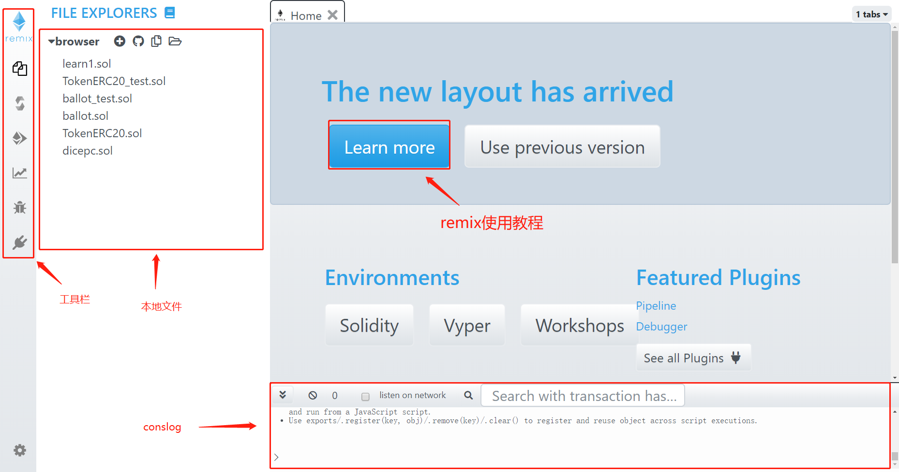
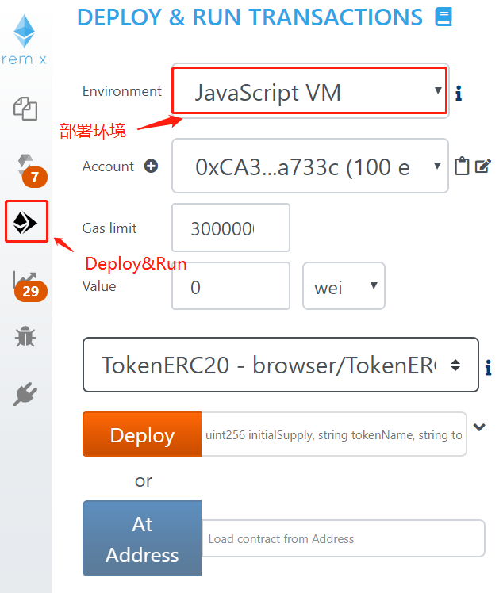

# Smart Contract Development

The BVM virtual machine supports solidity language and is compatible with the EVM virtual machine. It is recommended that developers use [Remix ID] <https://remix.ethereum.org/> to develop and debug smart contracts. After entering the Remix homepage, you will see the following page, you can click `Learn more` to learn to use Remix.

After the contract is written, it is recommended to select the `JavaScript VM` environment when performing simulated deployment.

