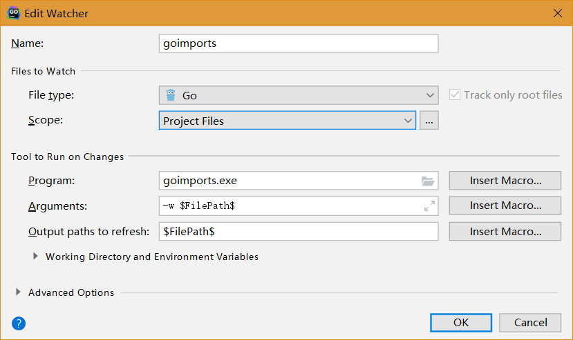
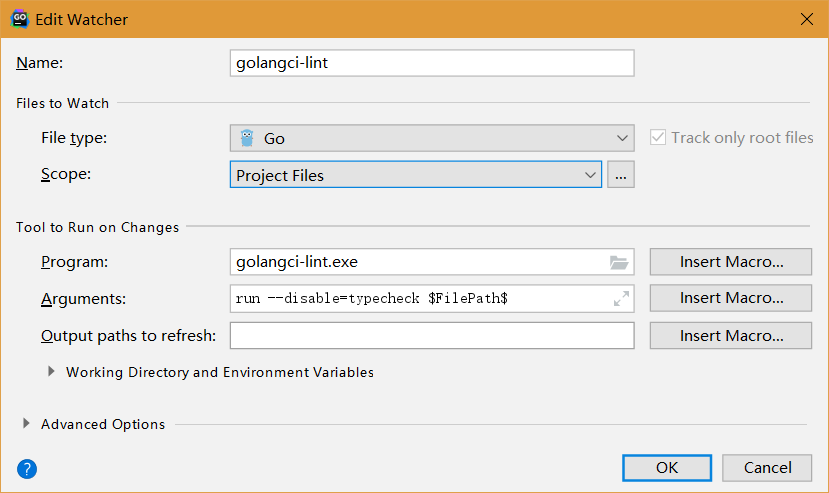

# 开发环境

本文我们以私有链 ``` hello``` 为目标来体验一下向区块链部署智能合约并进行调用。

## 1. 开发组织

首先我们要用测试账户 ``` alice``` 在私有链上注册一个用于测试的组织 ``` DAO``` ，命令如下：

``` 
[... pieces]# ./bcc registerOrg -k=wal -n=alice -p=Ab1@Ab1@ -g=500000 -o=DAO
OK
Response: {
  "code": 200,
  "log": "",
  "fee": 1250000000,
  "txHash": "d8466af21e72bb5d56236fc7d5af3fdb0e193fcc34e5dc346d5bc0ef5fc4c945",
  "height": 747,
  "orgID": "orgE37w7wxhZwaox1fhndt5Czm8WnLBrh6db"
}
``` 

按照上面返回交易哈希可以仿照上一章的方式查验这个交易的信息。

下面的命令可以根据前面返回的组织ID查询组织的详细信息：

``` 
[... pieces]# curl -s http://192.168.2.101:46657/abci_query? path=%22/organization/orgE37w7wxhZwaox1fhndt5Czm8WnLBrh6db%22 | ./jq .result.response.value | tr -d "\"" | base64 -d
{
  "orgID":"orgE37w7wxhZwaox1fhndt5Czm8WnLBrh6db",
  "name":"DAO",
  "orgOwner":"hello9A8BiLaA3nHK3upwCZ3aTztRGFbFMW82b",
  "contractAddrList":[],
  "orgCodeHash":null,
  "signers":[]
}
``` 

我们可以看到新注册的组织尚未部署智能合约，并且尚未指定智能合约的签名人。

下面我们需要用 ``` DAO``` 组织注册人的账户将 ``` alice``` 授权为 ``` DAO``` 组织的智能合约签名人：

``` 
[... pieces]# ./bcc setOrgSigners -k=wal -n=alice -p=Ab1@Ab1@ -g=500000 -o=DAO -s=[\"0xe5b95784049c3b8669aa58ba08abd9f54281df8905dd3af24bf795b0103f9ec7\"]
OK
Response: {
  "code": 200,
  "log": "",
  "fee": 1250000000,
  "txHash": "30f084f912d1360d958b9e057ff326dc08bf9d402863a66c60e2f8e683697266",
  "height": 774
}
``` 

下面我们需要用私有链 ``` hello``` 委员会的账户将 ``` alice``` 授权为 ``` DAO``` 组织智能合约的部署人：

``` 
[... pieces]# ./bcc setOrgDeployer -k=charter/wal/owner -n=owner -p=Ab1@Ab1@ -g=50000 -o=DAO -d=hello9A8BiLaA3nHK3upwCZ3aTztRGFbFMW82b
OK
Response: {
  "code": 200,
  "log": "",
  "fee": 125000000,
  "txHash": "98bb23e0f0248a04b2db4ff74b1dc10544887fa7673c64caea0b306a270c4a9e",
  "height": 884
}
``` 


## 2. IDE 资源

下面是智能合约的开发环境依赖的源码资源:

``` 
git clone https://github.com/bcbchain/thirdparty
git clone https://github.com/bcbchain/sdk
``` 

智能合约的开发环境依赖的开发资源：

``` 
GO:     GO 1.11 及以上版本

GoLand: JetBrains GoLand 2018.3.5 及以上版本
        需要安装 BCBChain 智能合约开发插件：sdk/plugin/bcbchain_goland_plugin_x.x.x.x-2018.zip
或
GoLand: JetBrains GoLand 2019.1.2 及以上版本
        需要安装 BCBChain 智能合约开发插件：sdk/plugin/bcbchain_goland_plugin_x.x.x.x-2019.zip
        需要将目录 thirdparty 和 sdk 设定为 GOPATH 
``` 


## 3. IDE 配置

强烈建议使用 ``` GoLand IDE``` 时使用如下的代码与编程风格配置。

强烈建议使用 ``` GoLand IDE``` 时配置在文件发生变化时自动对代码进行格式化并对代码进行静态分析。

本节描述一下IDE的典型配置。


**GOPATH**

``` 
File
	>> Settings
		>> GO
			>> GOPATH
				>> 在 Global GOPATH 中添加 thirdparty 和 sdk 目录
				>> 或者在 Project GOPATH 中添加 thirdparty 和 sdk 目录
``` 


**代码格式化与静态分析**:

``` 
File 
	>> Settings 
		>> Tools 
			>> File Watchers
				>> 添加并选中 'go fmt'
				>> 添加并选中 'goimports'
				>> 添加并选中 'golangci-lint'
``` 


 ``` go fmt``` 是 ``` golang``` 自带的工具。


 ``` goimports``` 是第三方开源工具，对代码中导入包的格式进行优化。配置模式为(Windows环境)：




 ``` golangci-lint``` 是第三方开源工具，用于对代码进行静态分析。配置模式为(Windows环境)：



BCBChain提供的智能合约开发 ``` SDK``` 提供的第三方包已经包含了这些工具的源码以及安装脚本（资源打包在 ``` tools``` 目录中）。


**制表符与代码缩进**

``` 
File 
	>> Settings 
		>> Editor 
			>> Code Style
				>> Go
					>> Tabs and Indents
						>> 选中 'Use tab character'
						>> 其它都不选中
``` 


**import格式**

``` 
File 
	>> Settings 
		>> Editor 
			>> Code Style
				>> Go
					>> Imports
						>> 'Sorting type' 选中 'gofmt'
						>> 选中 'Group stdlib imports'
						>> 选中 'Move all stdlib imports in a single group'
						>> 选中 'Move all imports in a single declaration'
						>> 其它都不选中
``` 

注：保持 ``` import``` 按不同类型的包进行分组是一个非常好的习惯。


**其它**

``` 
File 
	>> Settings 
		>> Editor 
			>> Code Style
				>> Go
					>> Other
						>> 都不选中
``` 

注：不能勾选 ``` "Add leading space to comments"``` ,否则会破坏BCBChain的合约标记。


## 4. 安装插件

GoLand 中安装 BCBChain 智能合约开发插件的执行路径如下：

``` 
File 
	>> Settings 
		>> Plugins 
			>> Marketplace && Installed && Updates && ... && Install Plugin from Disk
				>> Install Plugin from Disk
					>> sdk/plugin/bcbchain_goland_plugin_x.x.x.x-2019.zip
						>> OK
``` 

安装完成后，在 ``` GoLand IDE``` 左侧的 ``` Project``` 窗口中将鼠标移动到任意目录上点击鼠标右键出现的弹出菜单中将会新增一条操作选项： ``` BCB Smart Contract``` 。


## 5. 合约目录

为了开发智能合约，我们需要创建一个新的 ``` GoLand Project``` ，并在 ``` src``` 目录下创建子目录 ``` contract``` ，以后所有开发的智能合约都存放在这个目录下。


## 6. 导入私钥

 ``` alice``` 需要通过 BCBChain 智能合约开发插件将私钥导入 ``` GoLand``` 。

下面是 ``` alice``` 导出私钥的指令：

``` 
[... pieces]# ./bcw export -k=wal -n=alice -p=Ab1@Ab1@
``` 

下面是在 ``` GoLand``` 中导入 ``` alice``` 的开发私钥的执行路径：

``` 
GoLand左边栏 Project 浏览器
	>> 在源码目录上点击鼠标右键出现菜单
		>> BCB Smart Contrat
			>> Settings...
				>> 输入 Keystore
				>> 输入 Package Output Path
				>> OK
			>> Private Key...
				>> Import
					>> 输入 PrivaeKey #64字符16进制私钥(32字节ED25519私钥)
					>> 输入 Name      #alice
					>> 输入 Password
					>> OK
``` 

至此，``` alice``` 就可以通过一个账户搞定 ``` DAO``` 组织智能合约从开发、测试、发布、签名到部署的所有工作了。当然了，在现实中的区块链应该采用分工合作的方式来进行这些工作。


