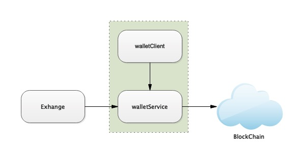

# bcbXwallet Deployment


## 1. Overview

Bcbchain wallet assets need to run the bcbxwallet program when dock to the exchange, which is a command line based wallet client tool in BCB network. The RPC service of the wallet can be started through bcbxwallet, and the trading station can obtain the block information through `bcb_block` interface, and make the entry judgment according to the field `transferreceipts` in the returned result.

bcbXwallet can connect to official nodes for work,**If the exchange needs to install a local full node**，please refer to [BCB Node](../01-BCBBasic/02-BCBNode.md)。

The relationship of the abovementioned components are described as below.



## 2. Installation package download

Download link:

```
https://github.com/bcbchain/xwallet/releases
```


## 3. Unpack Installation Package

​	Place the downloaded package in a temporary folder, then run the following command:

```
[tmp]# tar xvf bcb-Xwallet_xxx-x64.tar.gz
```


## 4. Launch Procedures

​	Enter “bcb-Xwallet_xxx-x64/.config” directory, modify the configuration file as required, and execute the following command:

```shell
[.config]vi bcbXwallet.yaml
```


​	Enter “bcb-Xwallet_xxx-x64” directory and execute the following command:

```
[bcb-Xwallet_xxx-x64]# ./bcbXwallet_rpc
```

​	After it is started, set the bcbXwallet_rpc listening port to：37657。You can change the listening port by modifying the file, "./.config/bcbXwallet.yaml".


​	Enter the following command to check if bcb-Xwallet service is run correctly:

```
[root]# netstat -lnp | grep 37657
```
