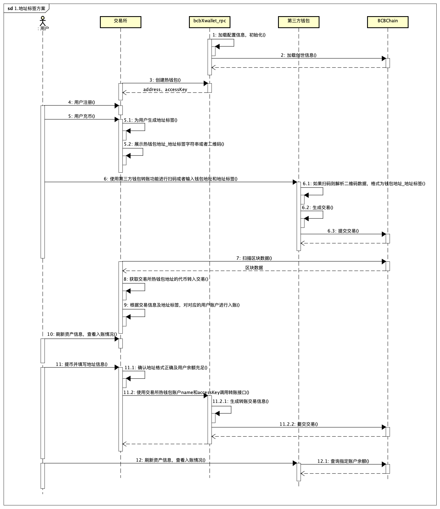

# How to Rapidly Setup with the Exchange

## 1. Setup using Address Labelling

**Setup using Address Labelling Explanation:**

​	BCBChain Exchange provides support for address labelling, hence the management can look into cryptocurrencies such as XRP and EOS.

​	The exchange can generate multiple hot wallet addresses, which can be shared between multiple different accounts. Each user can assign their own remark (commonly known as address label) to the wallet. Since different users can share the same currency address, the exchange does not need to perform time-consuming operations such as fund collection.

​	Users top up their values and make withdrawals through these hot wallets. This fulfills the cycle internally.

 

The four main considerations with regards to the exchange are as follows:

- From the BCBChain, multiple hot wallet addresses can be generated to form the coin address. Different users share these hot wallet addresses, with each user having the exchange generate a different address label for the particular user. In this way, even though the user uses the same address, the exchange can identify them based on the address label.
- To account for every user’s account activity, the exchange will retrieve the latest block at fixed interval. Based on the transfer type and address recorded in the block’s transactions, the exchange will be able to determine the exact user via the address label, and perform the necessary adjustments to the user’s account.
- To withdraw from the exchange, the exchange can call the bcbXwallet_rpc to transfer out from the hot wallet.
- With regards to wallet security, the exchange will need to store the encrypted password and access key of the wallets because the access keys are randomly generated. The exchange must use its own protection mechanisms to store these keys and encrypted passwords in a secure manner.

The process details are explained in the diagram below:

## 2. Setup without using Address Labels

**Setup without using address labels explanation:**

​	When you don't use the address label feature about BCBChain, you can not distinguish the activities of the users in the account by the exchange hot wallet address. In this case, the user can only be identified by the address. Hence, every user needs to have one unique account and one unique corresponding address, and manually maintain the currencies in their accounts on a periodic basis by spreading the tokens and distributing the allocated tokens back to the hot wallet.

The four main considerations with regards to the exchange are as follows:

- The user's address and the exchange's hot wallet cannot be integrated, and the user will have to manage the spread and aggregation of coins in the wallet to ensure smooth operations.
- It is impossible to aggregate the coins when performing charging and withdrawals, so it is necessary check that there is enough balance in the hot wallet.
- When charging the wallet, users only need to be mindful of the correct wallet address.
- Due to the increased number of wallets that need to be managed, more care needs to be taken to that the wallet’s encrypted password and access key are safe.

The process details are explained in the diagram below:

## 3. Transfer from cold wallet to hot wallet

**Transfer from cold wallet to hot wallet explanation:**

​	The online transfer method will not work for the cold wallet, so the signing of the transaction will be performed by the physical cold wallet.

The process details are explained in the diagram below:

 
