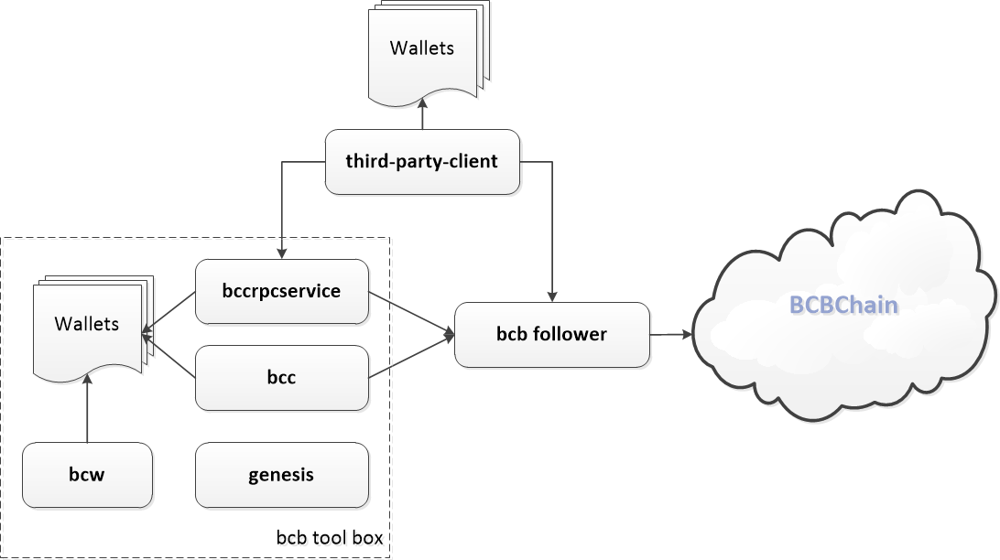

# Summary

BCBChain has many programs. The main programs for application development based on BCBChain are as follows:

* **bcb follower**

  BCBChain core node program, which is configured to run in observer mode, is actually composed of two programs: one is "bcchain", "bcchain" as an ABCI application of the tendermint architecture provides BCBChain's world state operation logic, and the other is "tendermint", "tendermint" is a service that the node provides to access the API of blockchain externally, and "tendermint" connects to BCBChain network through P2P network, synchronizes the latest block from BCBChain network, and broadcasts the locally signed transaction to BCBChain network.

* **bcb tool box**

  * **bcw** the command line wallet management program provided by BCBChain, it can generate the private key of wallet and save it.

  * **bcc** the core client program provided by BCBChain, everyone can publish various transactions to bcbchain through the command line.

  * **bccrpcservice** the core service program provided by BCBChain, it can provide a simple interface for third-party clients to access bcbchain and publish various transactions to bcbchain.

  * **genesis** the genesis creation tool provided by BCBChain, it can be used to create the creation information file of private chain when building private chain based on BCBChain's open source code.

The basic relationship between the above components is depicted in the figure below.

