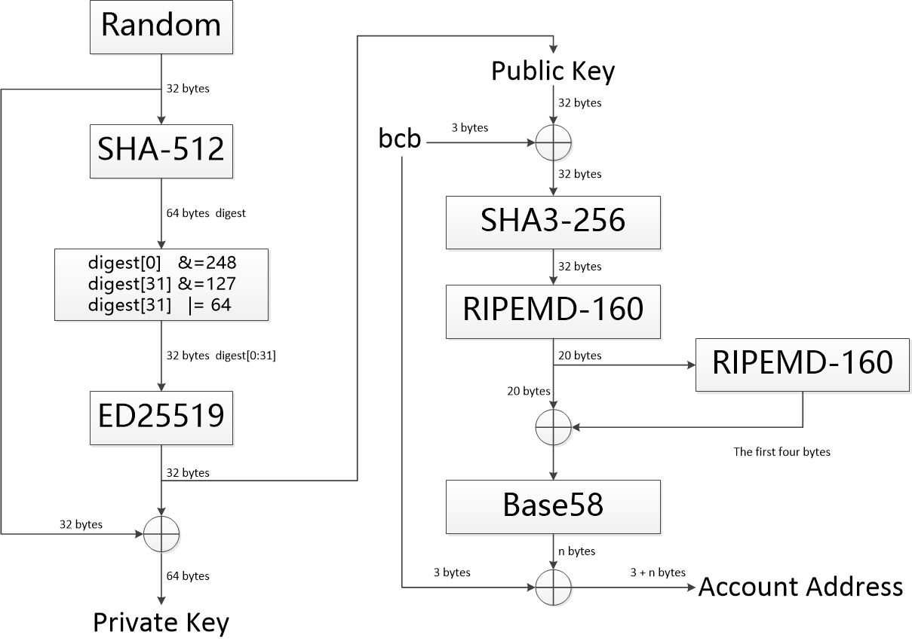

# Algorithm description

BCBChain uses many security algorithms, and we will explain in detail in this document.


## 1. Signature algorithm Ed25519

The BCBChain signature algorithm uses ed25519.

Curve25519/Ed25519/X25519 is an elliptic curve encryption / signature / key exchange algorithm independently designed by Daniel J. Bernstein, a famous cryptographer in 2006. It is completely independent from any existing elliptic curve algorithm, of which Ed25519 is used for signature.

Daniel J. Bernstein is a world-famous cryptographer. At present, another very popular high-performance secure stream cipher, ChaCha20, is also from Bernstein.

Since the publication of 25519 series curves in 2006, no one in the academic circle has paid attention to it. After Edward Snowden's exposure prism plan in 2013, the algorithm suddenly caught fire, and a large number of software, such as openssh, have rapidly increased their support for 25519 series. Now, 25519 has become the general trend. It is doubtful that NIST curve will leave the history stage of elliptic curve sooner or later. At present, RFC has increased SSL/TLS supports x25519 key exchange protocol, and the new version of OpenSSL 1.1 also adds support, which is the first step to get rid of big brother. The next step is to take ed25519 as an optional TLS certificate signing algorithm and get rid of NIST completely.

According to its website, Ed25519 algorithm has the following advantages:

* **completely open design**, the selection of parameters of the algorithm is straightforward, very clear, and there is no doubt. Compared with the currently widely used elliptic curve is NIST series standard, the coefficient of the equation is generated by using the unknown random seed c49d3608 86e70493 6a6678e1139d26b7 819f7e90, as for the origin of this seed, there is no information introduction;
* **high security**. Even if an elliptic curve encryption algorithm is mathematically safe, it is not necessarily safe in practice. It has a great probability to destroy security through cache, time and malicious input. However, the 25519 series elliptic curve has been specially designed to minimize the probability of error, which can be said to be the safest encryption algorithm in practice. For example, any 32-bit random number is a legal x25519 public key, so it is impossible to use malicious numerical attack. Some branch operations that the algorithm deliberately avoids in the design can be avoided in the programming, so that if can not be used in the programming, reducing the timing attack probability of different if branch codes with different execution time. On the contrary, NIST series elliptic curve algorithm is in the real world There is a great possibility of error in international application, and the immune ability to some theoretical attacks is not high. Bernstein has investigated all encryption algorithms on the market using 12 standards, and 25519 is almost the only one that meets these standards.
* **fast**, The 25519 series curve is the fastest elliptic curve encryption algorithm at present. Its performance is far better than NIST series, and it has higher security than P-256.

The following is the original description of its website:

* **Fast single-signature verification**.The softwaretakes only 273364 cycles to verify a signature on Intel's widely deployed Nehalem/Westmere lines of CPUs. (This performance measurement is for short messages; for very long messages, verification time is dominated by hashing time.) Nehalem and Westmere include all Core i7, i5, and i3 CPUs released between 2008 and 2010, and most Xeon CPUs released in the same period.
* **Even faster batch verification**.The software performs a batch of 64 separate signature verifications (verifying 64 signatures of 64 messages under 64 public keys) in only 8.55 million cycles, i.e., under 134000 cycles per signature. The software fits easily into L1 cache, so contention between cores is negligible: a quad-core 2.4GHz Westmere verifies 71000 signatures per second, while keeping the maximum verification latency below 4 milliseconds.
* **Very fast signing**.The software takes only 87548 cycles to sign a message. A quad-core 2.4GHz Westmere signs 109000 messages per second.
* **Fast key generation**.Key generation is almost as fast as signing. There is a slight penalty for key generation to obtain a secure random number from the operating system;/dev/urandomunder Linux costs about 6000 cycles.
* **High security level**.This system has a 2^128 security target; breaking it has similar difficulty to breaking NIST P-256, RSA with ~3000-bit keys, strong 128-bit block ciphers, etc. The best attacks known actually cost more than 2^140 bit operations on average, and degrade quadratically in success probability as the number of bit operations drops.
* **Foolproof session keys**.Signatures are generated deterministically; key generation consumes new randomness but new signatures do not. This is not only a speed feature but also a security feature, directly relevant to the recent collapse of the Sony PlayStation 3 security system.
* **Collision resilience**.Hash-function collisions do not break this system. This adds a layer of defense against the possibility of weakness in the selected hash function.
* **No secret array indices**.The software never reads or writes data from secret addresses in RAM; the pattern of addresses is completely predictable. The software is therefore immune to cache-timing attacks, hyperthreading attacks, and other side-channel attacks that rely on leakage of addresses through the CPU cache.
* **No secret branch conditions**.The software never performs conditional branches based on secret data; the pattern of jumps is completely predictable. The software is therefore immune to side-channel attacks that rely on leakage of information through the branch-prediction unit.
* **Small signatures**.Signatures fit into 64 bytes. These signatures are actually compressed versions of longer signatures; the times for compression and decompression are included in the cycle counts reported above.
* **Small keys**.Public keys consume only 32 bytes. The times for compression and decompression are again included.


## 2. Hash algorithm sha3-256

The main hash algorithm of BCBChain is SHA3-256.

In recent years, due to the successful attacks on traditional hash functions such as MD4, MD5, SHA0, SHA1, ripemd, etc., especially in 2005, Professor Wang Xiaoyun, a Chinese cryptology expert, joined hands with Yao Qizhi and his wife, put forward a cracking method to reduce the time of cracking SHA-1 from 269 steps to 263 steps, which forced NIST to choose a new secure hash function. NIST held two sessions of cryptographic hash seminars in 2005 and 2006 respectively; in 2007, NIST officially announced to solicit new next generation cryptographic hash algorithms worldwide and hold Sha-3 competition. The new hash algorithm will be called Sha-3, and as a new security hash standard, enhance the existing FIPS 180-2 standard. The algorithm submission was completed in October 2008. NIST held two rounds of meetings in 2009 and 2010, respectively, to select the algorithm to enter the final round through two rounds of screening, and finally published the winning algorithm in 2012. The whole process of open competition is modeled on the collection process of AES. On October 2, 2012, keccak algorithm was selected as the winner of NIST competition and became Sha-3.

Keccak has the same four hash sizes as SHA-2(224bit, 256bit, 384bit, and 512bit).

Keccak adopts a unique design concept different from the classic Merkle damgard structure, which has many excellent properties such as good compatibility, low implementation cost, good encryption performance and anti decryption ability. As soon as keccak is proposed, it has been highly concerned by the cryptology circle. After being declared as Sha-3 standard, keccak has become the hotspot of hash function research.

Keccak uses an innovative "sponge engine" to hash message text. It's fast, with an average speed of 12.5 cycles per byte under Intel Core 2. It is simple in design and convenient in hardware implementation.

Keccak has been able to resist attacks with a minimum complexity of 2n, where n is the size of the hash. It has a wide margin of safety. So far, third-party cryptanalysis has shown that keccak has no serious weakness.


## 3. Hash algorithm RIPEMD160

BCBChain account address generation algorithm is based on bitcoin mode, and it needs to output 20 bytes of address using ripemd160 hash algorithm.

Ripemd (race integrity primitives evaluation message digest), translated into Chinese as "race original integrity verification message digest", is a hash function algorithm developed by the cosic research group of the University of Leuven in Belgium. Ripemd uses the design principle of MD4 and improves the algorithm defects of MD4. In 1996, ripemd-128 was first released, which is similar to the popular SHA-1 in performance.

The 160 bit version of ripemd-160 is an improvement on ripemd-128 and is the most common version in the ripemd family. Compared with the SHA-1 and SHA-2 algorithms designed by NSA, the design principle of ripemd-160 is open.

In addition to the 128 bit and 160 bit versions, the ripemd algorithm also has 256 bit and 320 bit versions, which constitute four members of the ripemd family: ripemd-128, ripemd-160, ripemd-256, and ripemd-320. Among them, the security of 128 bit version has been questioned. 256 and 320 bit version reduce the possibility of accidental collision, but compared with ripemd-128 and ripemd-160, they do not have a high level of security, because they only modify the initial parameters and S-box to achieve the purpose of 256 and 320 bit output on the basis of 128 bit and 160 bit.


## 4. Serialization algorithm RLP

RLP(recursive length prefix): recursive length prefix.

RLP code is the serialization format of transaction data in bcbchain. See Appendix RLP for a detailed description.

RLP is designed to be a highly simplified serialization format with the sole purpose of storing nested byte arrays. Unlike protobuf, bson and other existing solutions, RLP does not define any specified data types, such as boolean, float, double or integer. It simply stores the structure as a nested array and leaves it to the protocol to determine the meaning of the array. RLP also does not explicitly support map sets. The semi official recommendation is to use a nested array in the form of [[K1, V1], [K2, V2],...] to represent the key value pair set. K1, K2... Are sorted according to the standard string.


## 5. Serialization algorithm JSON

JSON encoding is the serialization format of value in the state database of bcbchain, which is mainly for the convenience of decoding operation when the client queries.


## 6. Encoding algorithm base58

BCBChain uses base58 encoding format to convert some binary data into readable strings that are not easy to confuse.

Base58 is a unique encoding method used in bitcoin, which is mainly used to generate the wallet address of Bitcoin.

Base58 can be understood as a 58 base. Base58 contains Arabic numerals, lower case letters and upper case letters. But some confusing numbers and letters are removed: 0 (the number 0), O (the capital letter of O), l (the small letter of L), I (the capital letter of I).


Bcbchain uses the same base58 alphabet as bitcoin:

&nbsp;&nbsp;&nbsp;&nbsp;&nbsp;&nbsp;&nbsp;&nbsp;&nbsp;&nbsp;&nbsp;**123456789ABCDEFGHJKLMNPQRSTUVWXYZabcdefghijkmnopqrstuvwxyz**


## 7. Method ID

BCBChain's call mode of smart contract refers to Ethereum's call mode of smart contract. The method in the smart contract call transaction is represented by method ID. this section defines the generation algorithm of method id in detail.

* **method prototype example**

  `
      func Transfer(
          to types.Address,
          bn.Number
      )
  `

* **SETUP-1**

  | Method prototype processing algorithm                                |
  | ------------------------------------------------------------ |
  | 1、Delete the comment; <br>2、Delete the keyword func, and keep the method name; <br>3、Delete the parameter name, and keep the parameter type for each parameter; <br>4、Delete the return value name, and keep the parameter type for each return value; <br>5、Delete the line break and blank character, and keep the brackets and commas in the original type; <br>6、Processing result example：&nbsp;&nbsp; `Transfer(types.Address,bn.Number)` |

* **SETUP-2**

  | Method id calculation algorithm           |
  | ------------------------------------------------------------ |
  | 1、calculation: A1 = sha3-256 (string output by the method prototype processing algorithm); <br>2、value：MethodID = get\_first\_FOUR_bytes( A1 ); <br>3、example：0x44D8CA60(network byte order) |


## 8. Account address

| External account address calculation algorithm     |
| ------------------------------------------------------------ |
| 1、Preprocess the chain ID（such as "bcb"、"bcb[vcity]"）<br/>         if it is the main chain, the chain ID is the main chain ID;<br/>         if it is the side chain, extract the main chain ID from the side chain ID<br/>2、Use the main chain ID as the prefix of the data to be calculated;<br/>3、Then splice the 32 word public key as the original data; <br/>4、 Calculate the hash value: A1 = RIPEMD160( SHA3-256(original data) );<br/>5、Calculation check code: A2 = get_first_FOUR_bytes( RIPEMD160( A1 ) );<br/>6、Calculation account address: Address = chain ID \|\| Base58( A1 \|\| A2 )。 |

| Contract account address calculation algorithm               |
| ------------------------------------------------------------ |
| 1、Preprocess the chain ID（such as "bcb"、"bcb[vcity]"）<br/>         if it is the main chain, the chain ID is the main chain ID;<br/>         if it is the side chain, extract the main chain ID from the side chain ID<br/>2、Use the main chain ID as the prefix of the data to be calculated;<br>3、Then splice the name of the contract (the unique identification string under the same organization); <br>4、After that Splice the ID of the organization to which the contract belongs as the original data;<br>5、Calculate the hash value: A1 = RIPEMD160( SHA3-256(origin data) );<br>6、Calculate the check code: A2 = get_first_FOUR_bytes( RIPEMD160( A1 ) );<br>7、Calculate the account address of the contract: Address = chain ID \|\| Base58( A1 \|\| A2 )。 |

The following figure describes the relationship between private key, public key and account address:




## 9. Contract address

| Contract address calculation algorithm         |
| ------------------------------------------------------------ |
| 1、Preprocess the chain ID（such as "bcb"、"bcb[vcity]"）<br/>         if it is the main chain, the chain ID is the main chain ID;<br/>         if it is the side chain, extract the main chain ID from the side chain ID<br/>2、Use the main chain ID as the prefix of the data to be calculated;<br>3Then splice the unique identification string (contract name) provided by the contract under the same organization\|\| Contract version);<br>4、The ID of the organization to which the contract belongs is spliced as the original data;<br>5、Calculation hash value: A1 = RIPEMD160( SHA3-256(original data) );<br>6、Calculate the check code: A2 = get_first_FOUR_bytes( RIPEMD160( A1 ) );<br>7、Calculation contract address: Address = chain ID \|\| Base58( A1 \|\| A2 )。 |


### 10. Address conversion between main chain and side chain

For the same account or contract address, the main chain address and the side chain address are identical except for the prefix chain ID. For a given address, it is only necessary to transform the prefix's Chain ID below to perform free conversion between the primary and side chain addresses.


## 11. RLP

The purpose of RLP (Recursive Length Prefix) is to encode arbitrarily nested arrays of binary data, and RLP is the main encoding method used to serialize objects in Ethereum. The only purpose of RLP is to encode structure; encoding specific data types (eg. strings, floats) is left up to higher-order protocols; but positive RLP integers must be represented in big endian binary form with no leading zeroes (thus making the integer value zero be equivalent to the empty byte array). Deserialised positive integers with leading zeroes must be treated as invalid. The integer representation of string length must also be encoded this way, as well as integers in the payload. Additional information can be found in the Ethereum yellow paper Appendix B.

If one wishes to use RLP to encode a dictionary, the two suggested canonical forms are to either use [[k1,v1],[k2,v2]...] with keys in lexicographic order or to use the higher-level Patricia Tree encoding as Ethereum does.


**Definition**


 The RLP encoding function takes in an item. An item is defined as follows：

1. A string (ie. byte array) is an item

2. A list of items is an item


For example, an empty string is an item, as is the string containing the word "cat", a list containing any number of strings, as well as more complex data structures like ["cat",["puppy","cow"],"horse",[[]],"pig",[""],"sheep"]. Note that in the context of the rest of this article, "string" will be used as a synonym for "a certain number of bytes of binary data"; no special encodings are used and no knowledge about the content of the strings is implied.


RLP encoding is defined as follows:

1. For a single byte whose value is in the [0x00, 0x7f] range, that byte is its own RLP encoding.

2. Otherwise, if a string is 0-55 bytes long, the RLP encoding consists of a single byte with value 0x80 plus the length of the string followed by the string. The range of the first byte is thus [0x80, 0xb7].

3. If a string is more than 55 bytes long, the RLP encoding consists of a single byte with value 0xb7 plus the length in bytes of the length of the string in binary form, followed by the length of the string, followed by the string. For example, a length-1024 string would be encoded as \xb9\x04\x00 followed by the string. The range of the first byte is thus [0xb8, 0xbf].

4. If the total payload of a list (i.e. the combined length of all its items being RLP encoded) is 0-55 bytes long, the RLP encoding consists of a single byte with value 0xc0 plus the length of the list followed by the concatenation of the RLP encodings of the items. The range of the first byte is thus [0xc0, 0xf7].

5. If the total payload of a list is more than 55 bytes long, the RLP encoding consists of a single byte with value 0xf7 plus the length in bytes of the length of the payload in binary form, followed by the length of the payload, followed by the concatenation of the RLP encodings of the items. The range of the first byte is thus [0xf8, 0xff].


In code, this is:

  `

def rlp_encode(input):
    if isinstance(input,str):
        if len(input) == 1 and ord(input) < 0x80: return input
        else: return encode_length(len(input), 0x80) + input
    elif isinstance(input,list):
        output = ''
        for item in input: output += rlp_encode(item)
        return encode_length(len(output), 0xc0) + output

def encode_length(L,offset):
    if L < 56:
         return chr(L + offset)
    elif L < 256**8:
         BL = to_binary(L)
         return chr(len(BL) + offset + 55) + BL
    else:
         raise Exception("input too long")

def to_binary(x):
    if x == 0:
        return ''
    else:
        return to_binary(int(x / 256)) + chr(x % 256)

  `


**Examples**

The string "dog" = [ 0x83, 'd', 'o', 'g' ]

The list [ "cat", "dog" ] = [ 0xc8, 0x83, 'c', 'a', 't', 0x83, 'd', 'o', 'g' ]

The empty string ('null') = [ 0x80 ]

The empty list = [ 0xc0 ]

The integer 0 = [ 0x80 ]

The encoded integer 0 ('\x00') = [ 0x00 ]

The encoded integer 15 ('\x0f') = [ 0x0f ]

The encoded integer 1024 ('\x04\x00') = [ 0x82, 0x04, 0x00 ]

The set theoretical representation of three, [ [], [[]], [ [], [[]] ] ] = [ 0xc7, 0xc0, 0xc1, 0xc0, 0xc3, 0xc0, 0xc1, 0xc0 ]

The string "Lorem ipsum dolor sit amet, consectetur adipisicing elit" = [ 0xb8, 0x38, 'L', 'o', 'r', 'e', 'm', ' ', ... , 'e', 'l', 'i', 't' ]


**RLP decoding**


According to rules and process of RLP encoding, the input of RLP decode shall be regarded as Arrayof binary data, the process is as follows:

1. According to the first byte(i.e. prefix) of input data, and decoding the data type, the length of the actual data and offset;

2. According to type and offset of data, decode data correspondingly;

3. Continue to decode the rest of the input;


Among them, the rules of decoding data types and offset is as follows:

1. the data is a string if the range of the first byte(i.e. prefix) is [0x00, 0x7f], and the string is the first byte itself exactly;

2. the data is a string if the range of the first byte is [0x80, 0xb7], and the string whose length is equal to the first byte minus 0x80 follows the first byte;

3. the data is a string if the range of the first byte is [0xb8, 0xbf], and the length of the string whose length in bytes is equal to the first byte minus 0xb7 follows the first byte, and the string follows the length of the string;

4. the data is a list if the range of the first byte is [0xc0, 0xf7], and the concatenation of the RLP encodings of all items of the list which the total payload is equal to the first byte minus 0xc0 follows the first byte;

5. the data is a list if the range of the first byte is [0xf8, 0xff], and the total payload of the list whose length is equal to the first byte minus 0xf7 follows the first byte, and the concatenation of the RLP encodings of all items of the list follows the total payload of the list;


In code, this is:

```

def rlp_decode(input):
    if len(input) == 0:
        return
    output = ''
    (offset, dataLen, type) = decode_length(input)
    if type is str:
        output = instantiate_str(substr(input, offset, dataLen))
    elif type is list:
        output = instantiate_list(substr(input, offset, dataLen))
    output + rlp_decode(substr(input, offset + dataLen))
    return output

def decode_length(input):
    length = len(input)
    if length == 0:
        raise Exception("input is null")
    prefix = ord(input[0])
    if prefix <= 0x7f:
        return (0, 1, str)
    elif prefix <= 0xb7 and length > prefix - 0x80:
        strLen = prefix - 0x80
        return (1, strLen, str)
    elif prefix <= 0xbf and length > prefix - 0xb7 and length > prefix - 0xb7 + to_integer(substr(input, 1, prefix - 0xb7)):
        lenOfStrLen = prefix - 0xb7
        strLen = to_integer(substr(input, 1, lenOfStrLen))
        return (1 + lenOfStrLen, strLen, str)
    elif prefix <= 0xf7 and length > prefix - 0xc0:
        listLen = prefix - 0xc0;
        return (1, listLen, list)
    elif prefix <= 0xff and length > prefix - 0xf7 and length > prefix - 0xf7 + to_integer(substr(input, 1, prefix - 0xf7)):
        lenOfListLen = prefix - 0xf7
        listLen = to_integer(substr(input, 1, lenOfListLen))
        return (1 + lenOfListLen, listLen, list)
    else:
        raise Exception("input don't conform RLP encoding form")

def to_integer(b):
    length = len(b)
    if length == 0:
        raise Exception("input is null")
    elif length == 1:
        return ord(b[0])
    else:
        return ord(substr(b, -1)) + to_integer(substr(b, 0, -1)) * 256

```


## 11. Base58

Base58 is a group of binary-to-text encoding schemes used to represent large integers as alphanumeric text. It is similar to Base64 but has been modified to avoid both non-alphanumeric characters and letters which might look ambiguous when printed. It is therefore designed for human users who manually enter the data, copying from some visual source, but also allows easy copy and paste because a double-click will usually select the whole string.

Compared to Base64, the following similar-looking letters are omitted: 0 (zero), O (capital o), I (capital i) and l (lower case L) as well as the non-alphanumeric characters + (plus) and / (slash). In contrast to Base64, the digits of the encoding do not line up well with byte boundaries of the original data. For this reason, the method is well-suited to encode large integers, but not designed to encode longer portions of binary data. The actual order of letters in the alphabet depends on the application, which is the reason why the term “Base58” alone is not enough to fully describe the format. A variant, Base56, excludes 1 (one) and o (lowercase o) compared to Base 58.


