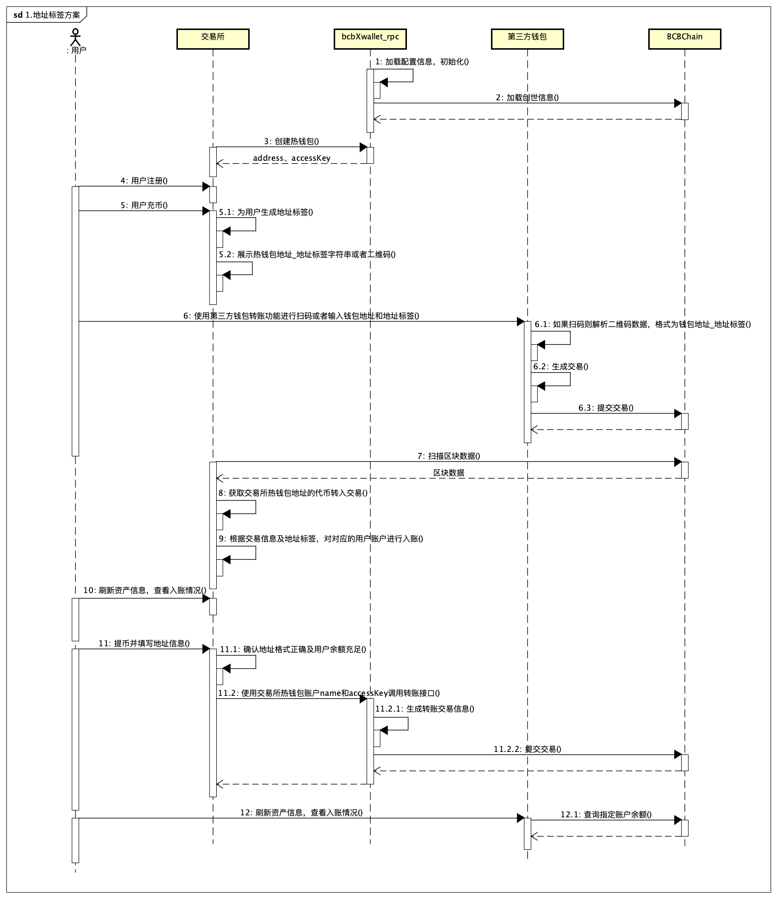
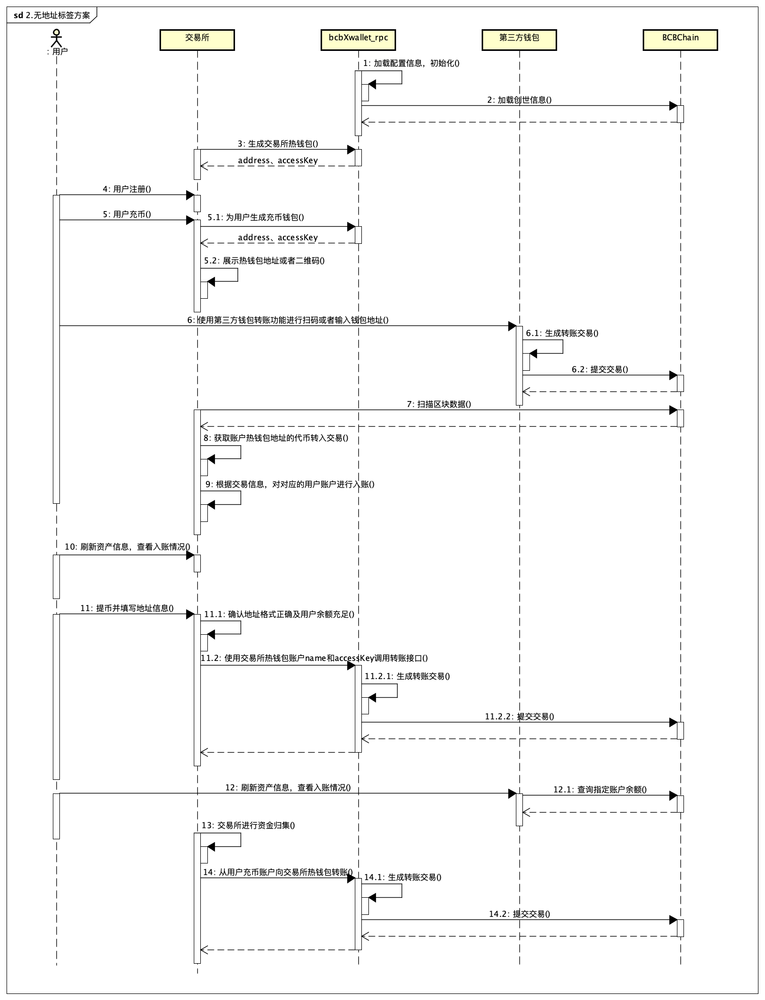
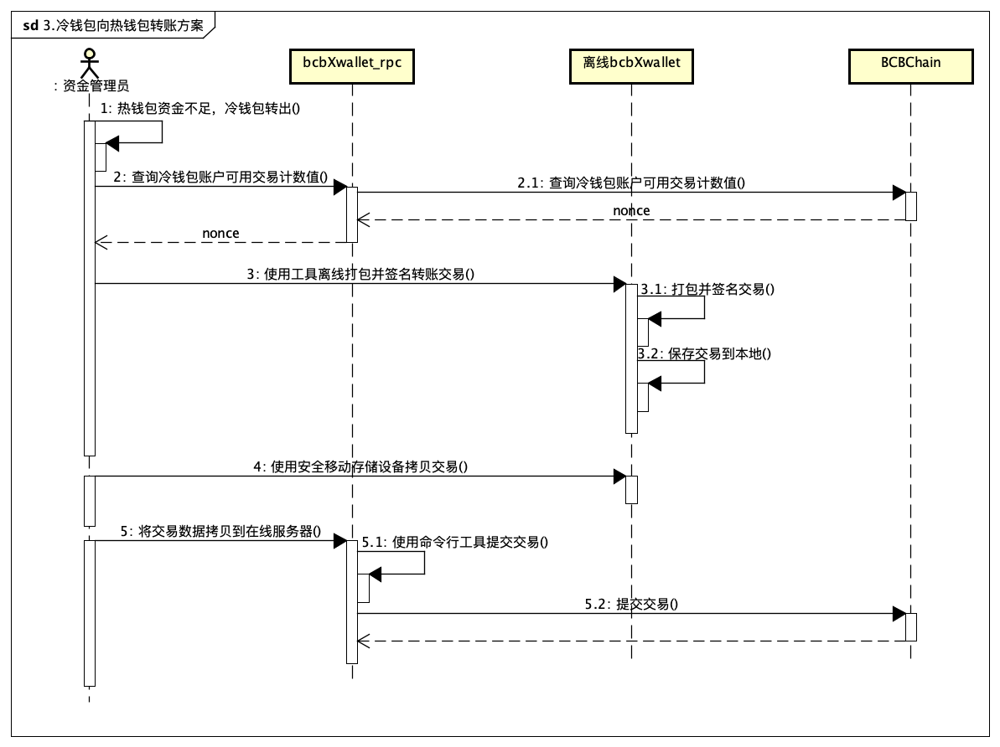

# 交易所快速集成方案

## 1. 地址标签方案

**带地址标签集成方案说明**：

​	BCB链的交易支持设置备注，因此交易所的处理可以参考XRP和EOS这类区块链币种。

​	交易所只需要生成多个热钱包地址，不同的用户充币地址可以共用这些热钱包地址，通过给每一位用户生成不同的备注信息（大部分交易所俗称为“地址标签”），来实现不同的用户共用1个交易所的充币地址，这样交易所无需执行资金归集等耗时的操作。

​	用户充币都充值到热钱包，用户提币的时候也是从这个热钱包出。实现内部循环。

 

对于交易所而言，主要是考虑如下4个问题：

- 为用户生成充币地址，从调用BCB链的角度出发，只需要生成若干个热钱包地址，不同的用户均共享这些热钱包地址，交易所为每一个用户生成不同的地址标签，这样尽管不同的用户充币到了同一个地址，但是可以通过地址标签进行区分。
- 判断用户充币到账，从调用BCB链的角度出发，交易所只需要定期获取最新区块，判断区块的转账类型交易中，是否有涉及交易站地址的交易，若有则进行解析，判断是哪个用户的地址标签以及币种，进行相应的入账。
- 给用户提币，从调用BCB链的角度出发，交易所只需要调用bcbXwallet_rpc使用热钱包给用户转账就可以。
- 钱包的安全性，从调用BCB链的角度出发，因为bcbXwallet_rpc生成的所有钱包均采用随机生成的钱包访问密钥和用户密码进行加密，交易所需要采用自己的安全机制妥善保管好钱包的加密密码和访问密钥。

具体集成流程如下图：

## 2. 无地址标签方案

**无地址标签集成方案说明**：

​	当不使用BCB链的交易数据中的备注功能时，则无法通过备注的地址标签和统一的交易所热钱包地址来识别不同的用户充币操作；此时在用户进行充币时则需要为用户生成账户唯一的充币账户作为用户账号对应的唯一收币地址，并定期对交易所中的充币地址进行归集操作，将用户充币分散到各个充币地址中的代币集中到交易所热钱包中。

对交易所而言，需要考虑如下4个问题：

- 用户充币地址和交易所提币热钱包不能统一，同时需要管理好用户的充币钱包，保证定期对充币钱包进行归集时能够顺利进行。
- 应为用户充币和用户提币不能实现能不循环，所以需要时刻关注提币热钱包中的余额，以保证用户提币时能够有足够的余额。
- 对用户充币操作只需要关注用户充币地址的转入交易即可。
- 由于所需管理的钱包数量增加，所以需要更加注意妥善保管好钱包加密密码和访问密钥。

具体步骤如下图：

## 3. 冷钱包向热钱包转账方案

**冷钱包离线转账方案**

​	当冷钱包需要向热钱包转出代币时，不能通过在线的转账功能完成交易的打包签名操作，此时就需要借助物理上离线的冷钱包进行转账交易的打包及签名。

具体步骤如下图：

 