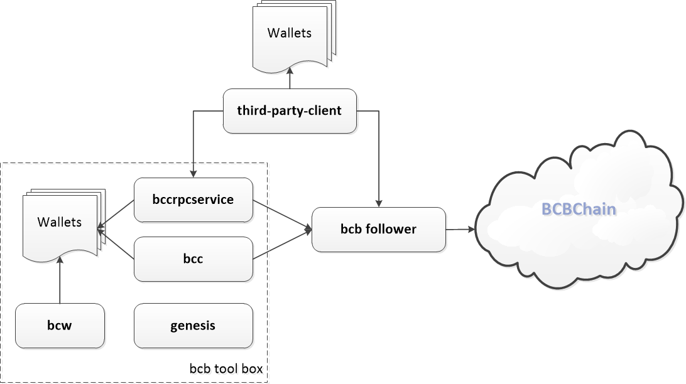

# 概述

BCBChain自带很多程序，基于BCBChain进行应用开发将会用到的主要程序如下：

* **bcb follower**

  BCBChain 核心节点程序，被配置为运行于观察者模式，实际上由两个程序组成，一个是 “bcchain”， “bcchain” 作为 tendermint 架构的 ABCI 应用提供 BCBChain 的世界状态运行逻辑，另一个是 “tendermint”， “tendermint” 是节点对外提供区块链访问API的服务，同时 “tendermint” 通过 P2P 网络连接到 BCBChain 网络，从 BCBChain 网络同步最新区块，并向 BCBChain 网络广播本地签署的交易。

* **bcb tool box**

  * **bcw** BCBChain提供的命令行钱包管理程序，可以提供生成钱包私钥并进行保存的功能。

  * **bcc** BCBChain提供的核心客户端程序，可以通过命令行向BCBChain发布各种交易。

  * **bccrpcservice** BCBChain提供的核心服务程序，可以对第三方客户端提供访问BCBChain并向BCBChain发布各种交易的简便接口。

  * **genesis** BCBChain提供的创世工具，可用于基于BCBChain的开源代码搭建私有链时创建私有链的创世信息文件。

上述组件之间的基本关系由下图进行描绘。

