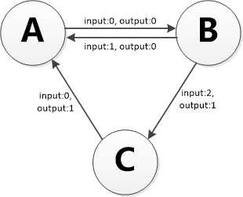
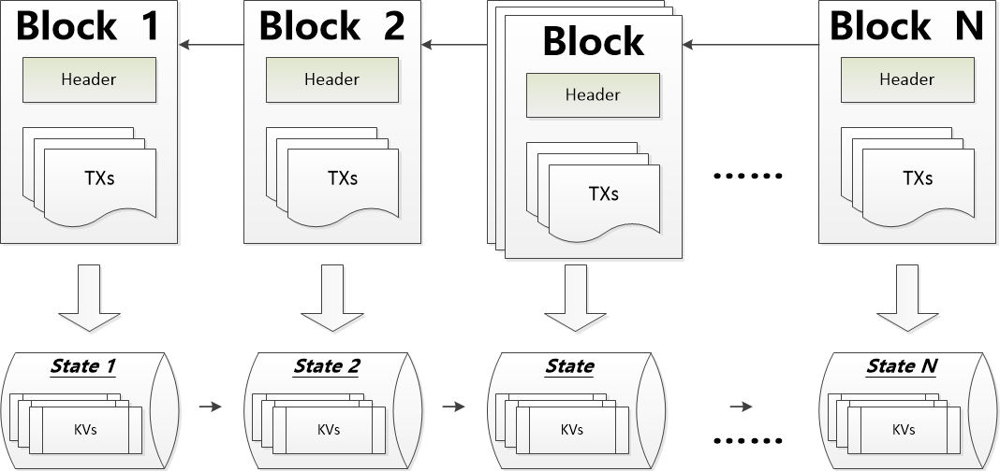

# 模型说明

## 1. 模型概览

BCBChain参考了Ethereum、Fabric、Tendermint、Cosmos等开源区块链方案，借鉴了其中一些优秀思想。

BCBChain在本质上是一个基于交易的状态机(transaction-based state machine)。在计算机科学中，状态机是一个包含一组状态集（states）、一个起始状态（start state）、一组输入符号集（alphabet）、一个映射输入符号和当前状态到下一状态的转换函数（transition function）的计算模型。

在BCBChain其中状态集由状态数据库进行表达，起始状态被称为创世状态（genesis state），输入的符号集就是在区块链领域常说的交易（transaction，简称tx），状态转换函数就是智能合约。

根据BCBChain的状态机，我们从创世状态(genesis state)开始。这差不多类似于一片空白的石板，在网络中还没有任何交易产生的状态。当交易被执行后，这个创世纪状态就会转变成最终状态。在任何时刻，这个最终状态都代表着BCBChain当前的状态。

BCBChain的状态由成千上万个交易达成。这些交易都被“组团”到一个个区块中。一个区块包含了一系列的交易，每个区块都与它的前一个区块链接起来，每一个区块都会导致状态机达到一个新的状态。

为了让一个状态转换成下一个状态，交易必须是有效的（也就是促使采用区块链技术的不可抵赖特性需求）。为了让一个交易被认为是有效的，它必须要经过一个验证过程，每一个交易都必须由交易发起人通过自己的私钥进行签名，并且在BCBChain的智能合约中校验满足一定的条件，才能被认为是有效的。

## 2. 账户说明

BCBChain的全局“共享状态”是由很多小对象（账户）来组成的，这些账户可以通过消息传递架构来与对方进行交互。BCBChain的账户概念借鉴了Ethereum的账户概念，每个账户都有一个与之关联的状态(state)和一个编码的地址(address)。BCBChain拥有两种类型的账户：

* **外部账户**，被私钥控制且没有任何代码与之关联；

* **合约账户**，被它们的合约代码控制且有代码与之关联；合约账户只与合约的名称相关，与合约的版本及所有者等信息无关，合约升级以后，新版本合约将会启用新的合约地址，但是合约的账户地址保持不变。

## 3. BCBChain通证

BCBChain在创世时定义了基础通证，同时在内置的基础合约当中实现了基于基础通证的业务逻辑，我们把它命名为BCB。

BCB的计量单位参照比特币的概念，定义如下：

| **单位**  | **Cong值**           |
| --------- | -------------------- |
| **cong**  | 1 cong               |
| **Kcong** | 1,000   cong         |
| **Mcong** | 1,000,000   cong     |
| **BCB**   | 1,000,000,000   cong |

## 4. BCBChain链ID

BCBChain在创世时定义了链ID，取值为“bcb”，与BCBChain对应的测试链（用于试验BUG修正、新特性等）的链ID，取值为“bcbtest”。

BCBChain代码开源以后，如果部署私有链或测试链，链ID除“bcb”与“bcbtest”以外可以任意选取。

## 5. BCB生态侧链ID

基于BCB生态的侧链创世时可以自由指定侧链名称，侧链的链ID基于如下算法构造而成：

| 侧链ID构造算法                                               |
| ------------------------------------------------------------ |
| 1、计算侧链ID：主链ID[任意名称] 2、例如：主链ID=bcb                   侧链名称=vcity                   侧链ID=bcb[vcity] |

