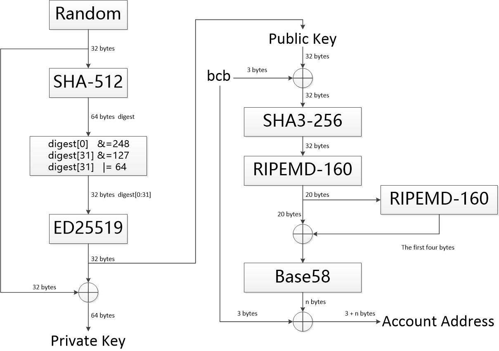

# 算法说明

BCBChain使用了多种安全算法，我们将在本文档进行详细说明。


## 1. 签名算法Ed25519

BCBChain签名算法采用Ed25519。

Curve25519/Ed25519/X25519 是著名密码学家 Daniel J. Bernstein 在 2006 年独立设计的椭圆曲线加密 / 签名 /密钥交换算法，和现有的任何椭圆曲线算法都完全独立，其中Ed25519用于签名。

Daniel J. Bernstein 是世界著名的密码学家，目前另一个非常火的高性能安全流密码 ChaCha20 也是出自 Bernstein 之手。

25519 系列曲线自 2006 年发表以来，除了学术界无人问津， 2013 年爱德华·斯诺登曝光棱镜计划后，该算法突然大火，大量软件，如 OpenSSH 都迅速增加了对 25519 系列的支持，如今 25519 已经是大势所趋，可疑的 NIST 曲线迟早要退出椭圆曲线的历史舞台，目前， RFC 增加了 SSL/TLS 对 X25519 密钥交换协议的支持，而新版 OpenSSL 1.1 也加入支持，是摆脱老大哥的第一步，下一步是将 Ed25519 做为可选的 TLS 证书签名算法，彻底摆脱 NIST 。

根据其网站介绍，Ed25519算法具有以下优势：

* **完全开放的设计**，算法各参数的选择直截了当，非常明确，没有任何可疑之处，相比之下目前广泛使用的椭圆曲线是 NIST 系列标准，方程的系数是使用来历不明的随机种子 c49d3608 86e70493 6a6678e1 139d26b7 819f7e90 生成的，至于这个种子的来历没有资料介绍；
* **安全性高**，一个椭圆曲线加密算法就算在数学上是安全的，在实用上也并不一定安全，有很大的概率通过缓存、时间、恶意输入摧毁安全性，而 25519 系列椭圆曲线经过特别设计，尽可能的将出错的概率降到了最低，可以说是实践上最安全的加密算法。例如，任何一个 32 位随机数都是一个合法的 X25519 公钥，因此通过恶意数值攻击是不可能的，算法在设计的时候刻意避免的某些分支操作，这样在编程的时候可以不使用 if ，减少了不同 if 分支代码执行时间不同的时序攻击概率，相反， NIST 系列椭圆曲线算法在实际应用中出错的可能性非常大，而且对于某些理论攻击的免疫能力不高， Bernstein 对市面上所有的加密算法使用 12 个标准进行了考察， 25519 是几乎唯一满足这些标准的。
* **速度快**， 25519 系列曲线是目前最快的椭圆曲线加密算法，性能远远超过 NIST 系列，而且具有比 P-256 更高的安全性。

以下为其网站的描述原文：

* **Fast single-signature verification**.The softwaretakes only 273364 cycles to verify a signature on Intel's widely deployed Nehalem/Westmere lines of CPUs. (This performance measurement is for short messages; for very long messages, verification time is dominated by hashing time.) Nehalem and Westmere include all Core i7, i5, and i3 CPUs released between 2008 and 2010, and most Xeon CPUs released in the same period.
* **Even faster batch verification**.The software performs a batch of 64 separate signature verifications (verifying 64 signatures of 64 messages under 64 public keys) in only 8.55 million cycles, i.e., under 134000 cycles per signature. The software fits easily into L1 cache, so contention between cores is negligible: a quad-core 2.4GHz Westmere verifies 71000 signatures per second, while keeping the maximum verification latency below 4 milliseconds.
* **Very fast signing**.The software takes only 87548 cycles to sign a message. A quad-core 2.4GHz Westmere signs 109000 messages per second.
* **Fast key generation**.Key generation is almost as fast as signing. There is a slight penalty for key generation to obtain a secure random number from the operating system;/dev/urandomunder Linux costs about 6000 cycles.
* **High security level**.This system has a 2^128 security target; breaking it has similar difficulty to breaking NIST P-256, RSA with ~3000-bit keys, strong 128-bit block ciphers, etc. The best attacks known actually cost more than 2^140 bit operations on average, and degrade quadratically in success probability as the number of bit operations drops.
* **Foolproof session keys**.Signatures are generated deterministically; key generation consumes new randomness but new signatures do not. This is not only a speed feature but also a security feature, directly relevant to the recent collapse of the Sony PlayStation 3 security system.
* **Collision resilience**.Hash-function collisions do not break this system. This adds a layer of defense against the possibility of weakness in the selected hash function.
* **No secret array indices**.The software never reads or writes data from secret addresses in RAM; the pattern of addresses is completely predictable. The software is therefore immune to cache-timing attacks, hyperthreading attacks, and other side-channel attacks that rely on leakage of addresses through the CPU cache.
* **No secret branch conditions**.The software never performs conditional branches based on secret data; the pattern of jumps is completely predictable. The software is therefore immune to side-channel attacks that rely on leakage of information through the branch-prediction unit.
* **Small signatures**.Signatures fit into 64 bytes. These signatures are actually compressed versions of longer signatures; the times for compression and decompression are included in the cycle counts reported above.
* **Small keys**.Public keys consume only 32 bytes. The times for compression and decompression are again included.


## 2. 散列算法SHA3-256

BCBChain的主要散列算法采用SHA3-256。

由于近年来对传统常用Hash 函数如MD4、MD5、SHA0、SHA1、RIPEMD 等的成功攻击，尤其2005年，中国密码学专家王小云教授，联手姚期智夫妇，提出了一种破解方法，将破解SHA-1的时间从269步降低到263步，让美国国家标准技术局(NIST)不得不着手选择新的安全哈希函数。NIST在2005年、2006年分别举行了2届密码Hash 研讨会；于2007年正式宣布在全球范围内征集新的下一代密码Hash算法，举行SHA-3竞赛。新的Hash算法将被称为SHA-3，并且作为新的安全Hash标准，增强现有的FIPS 180-2标准。算法提交已于2008年10月结束，NIST分别于2009年和2010年举行2轮会议，通过2轮的筛选选出进入最终轮（final round）的算法，最后在2012年公布获胜算法。公开竞赛的整个进程仿照高级加密标准AES 的征集过程。2012年10月2日，Keccak算法被选为NIST竞赛的胜利者，成为SHA-3。

Keccak具有同SHA-2相同的四个散列大小(224bit、256bit、384bit或512bit)。

Keccak采用区别于经典Merkle-Damgard结构的独特设计理念，具有兼容性好、实现代价低、拥有良好的加密性能以及抗解密能力等诸多优良的性质。Keccak一经提出便受到了密码学界的高度关注，被宣布为SHA-3标准后更成为当前Hash函数研究的热点。

Keccak采用了创新的的“海绵引擎”散列消息文本。它是快速的，在英特尔酷睿2处理器下的平均速度为12.5周期每字节。它设计简单，方便硬件实现。

Keccak已可以抵御最小的复杂度为2n的攻击，其中n为散列的大小。它具有广泛的安全边际。至目前为止，第三方密码分析已经显示出Keccak没有严重的弱点。


## 3. 散列算法RIPEMD160

BCBChain账户地址生算法成借鉴比特币的模式，需要使用散列算法RIPEMD160输出20字节的地址。

RIPEMD（RACE Integrity Primitives Evaluation Message Digest），中文译为“RACE原始完整性校验消息摘要”，是比利时鲁汶大学COSIC研究小组开发的散列函数算法。RIPEMD使用MD4的设计原理，并针对MD4的算法缺陷进行改进，1996年首次发布RIPEMD-128版本，在性能上与较受欢迎的SHA-1相似。

160位版本RIPEMD-160是对RIPEMD-128的改进，并且是RIPEMD家族中最常见的版本。相比于美国国家安全局设计的SHA-1和SHA-2算法，RIPEMD-160的设计原理是开放的。

除了128位和160位版本，RIPEMD算法也存在256位和320位版本，构成RIPEMD家族的四个成员：RIPEMD-128、RIPEMD-160、RIPEMD-256、RIPEMD-320。其中128位版本的安全性已经被质疑，256和320位版本减少了意外碰撞的可能性，但是相比于RIPEMD-128和RIPEMD-160，它们不具有较高水平的安全性，因为他们只是在128位和160位的基础上，修改了初始参数和s-box来达到输出为256和320位的目的。


## 4. 序列化算法RLP

RLP(recursive length prefix)：递归长度前缀。

RLP编码是BCBChain中交易数据的序列化格式。详细描述参见附录RLP。

RLP旨在成为高度简化的序列化格式，它唯一的目的是存储嵌套的字节数组。不同于 protobuf、BSON 等现有的解决方案，RLP 并不定义任何指定的数据类型，如Boolean、float、double 或者 integer。它仅仅是以嵌套数组的形式存储结构，并将其留给协议来确定数组的含义。RLP 也没有明确支持map集合，半官方的建议是采用 [[k1, v1], [k2, v2], ...] 形式的嵌套数组来表示键值对集合，k1, k2 ... 按照字符串的标准排序。


## 5. 序列化算法JSON

JSON编码是BCBChain中状态数据库中Value的序列化格式，主要是为了方便客户端查询时的解码操作。


## 6. 编码算法Base58

BCBChain采用Base58编码格式将某些二进制数据转换成可读并不容易产生混淆的字符串。

Base58是用于Bitcoin中使用的一种独特的编码方式，主要用于产生Bitcoin的钱包地址。

Base58可以理解为一种58进制。Base58包含了阿拉伯数字、小写英文字母，大写英文字母。但是去掉了一些容易混淆的数字和字母：0（数字0）、O（o的大写字母）、l（ L的小写字母）、I（i的大写字母）。


BCBChain采用的Base58字母表与比特币一致：

&nbsp;&nbsp;&nbsp;&nbsp;&nbsp;&nbsp;&nbsp;&nbsp;&nbsp;&nbsp;&nbsp;**123456789ABCDEFGHJKLMNPQRSTUVWXYZabcdefghijkmnopqrstuvwxyz**


## 7. 方法ID

BCBChain中对智能合约的调用模式借鉴了以太坊的智能合约调用模式，在智能合约调用交易中智能合约中的方法以方法ID（MethodID）的方式体现，本小节详细定义方法ID的生成算法。

* **方法原型示例**

  `
      func Transfer(
          to types.Address,
          bn.Number
      )
  `

* **SETUP-1**

  | 方法原型处理算法                                             |
  | ------------------------------------------------------------ |
  | 1、删除注释；<br>2、删除关键字func，保留方法名称；<br>3、删除参数名称，为每个参数保留参数类型；<br>4、删除返回值名称，为每个返回值保留参数类型；<br>5、删除换行符与空白符，保留原型中的括弧与逗号；<br>6、处理结果示例：&nbsp;&nbsp; `Transfer(types.Address,bn.Number)` |

* **SETUP-2**

  | 方法ID计算算法                                               |
  | ------------------------------------------------------------ |
  | 1、计算：A1 = SHA3-256(方法原型处理算法输出的字符串)；<br>2、取值：MethodID = get\_first\_FOUR_bytes( A1 )；<br>3、示例：0x44D8CA60 (网络字节序)。 |


## 8. 账户地址

| 外部账户地址计算算法                                         |
| ------------------------------------------------------------ |
| 1、对链ID（例如“bcb”、“bcb[vcity]”）进行预处理：<br/>         如果是主链，链ID就是主链ID；<br/>         如果是侧链，从侧链ID中提取出主链ID<br/>2、采用主链ID作为待计算数据的前缀；<br/>3、之后拼接上32字节公钥作为原始数据；<br/>4、计算散列值：A1 = RIPEMD160( SHA3-256(原始数据) )；<br/>5、计算校验码：A2 = get_first_FOUR_bytes( RIPEMD160( A1 ) )；<br/>6、计算账户地址：Address = 链ID \|\| Base58( A1 \|\| A2 )。 |

| 合约账户地址计算算法                                         |
| ------------------------------------------------------------ |
| 1、对链ID（例如“bcb”、“bcb[vcity]”）进行预处理：<br/>         如果是主链，链ID就是主链ID；<br/>         如果是侧链，从侧链ID中提取出主链ID<br/>2、采用主链ID作为待计算数据的前缀；<br>3、之后拼接上合约的名称（同一个组织下的唯一识别字符串）；<br>4、之后拼接上合约所属组织的ID作为原始数据；<br>5、计算散列值：A1 = RIPEMD160( SHA3-256(原始数据) )；<br>6、计算校验码：A2 = get_first_FOUR_bytes( RIPEMD160( A1 ) )；<br>7、计算合约的账户地址：Address = 链ID \|\| Base58( A1 \|\| A2 )。 |

下图描述了私钥、公钥与账户地址的关系：




## 9. 合约地址

| 合约地址计算算法                                             |
| ------------------------------------------------------------ |
| 1、对链ID（例如“bcb”、“bcb[vcity]”）进行预处理：<br/>         如果是主链，链ID就是主链ID；<br/>         如果是侧链，从侧链ID中提取出主链ID<br/>2、采用主链ID作为待计算数据的前缀；<br>3、之后拼接上由合约的提供同一个组织下的唯一识别字符串（合约名称 \|\| 合约版本 )；<br>4、之后拼接上合约所属组织的ID作为原始数据；<br>5、计算散列值：A1 = RIPEMD160( SHA3-256(原始数据) )；<br>6、计算校验码：A2 = get_first_FOUR_bytes( RIPEMD160( A1 ) )；<br>7、计算合约地址：Address = 链ID \|\| Base58( A1 \|\| A2 )。 |


### 10. 主链与侧链地址转换

对于同一个账户或合约地址，主链地址与侧链地址除了前缀的链ID不同以外，地址其它部分完全相同。对于一个给定的地址，只需要将前缀的链ID变换以下就可以在主链与侧链地址之间进行自由转换。


## 11. RLP

The purpose of RLP (Recursive Length Prefix) is to encode arbitrarily nested arrays of binary data, and RLP is the main encoding method used to serialize objects in Ethereum. The only purpose of RLP is to encode structure; encoding specific data types (eg. strings, floats) is left up to higher-order protocols; but positive RLP integers must be represented in big endian binary form with no leading zeroes (thus making the integer value zero be equivalent to the empty byte array). Deserialised positive integers with leading zeroes must be treated as invalid. The integer representation of string length must also be encoded this way, as well as integers in the payload. Additional information can be found in the Ethereum yellow paper Appendix B.

If one wishes to use RLP to encode a dictionary, the two suggested canonical forms are to either use [[k1,v1],[k2,v2]...] with keys in lexicographic order or to use the higher-level Patricia Tree encoding as Ethereum does.

 

**Definition**


 The RLP encoding function takes in an item. An item is defined as follows：

1. A string (ie. byte array) is an item

2. A list of items is an item


For example, an empty string is an item, as is the string containing the word "cat", a list containing any number of strings, as well as more complex data structures like ["cat",["puppy","cow"],"horse",[[]],"pig",[""],"sheep"]. Note that in the context of the rest of this article, "string" will be used as a synonym for "a certain number of bytes of binary data"; no special encodings are used and no knowledge about the content of the strings is implied.


RLP encoding is defined as follows:

1. For a single byte whose value is in the [0x00, 0x7f] range, that byte is its own RLP encoding.

2. Otherwise, if a string is 0-55 bytes long, the RLP encoding consists of a single byte with value 0x80 plus the length of the string followed by the string. The range of the first byte is thus [0x80, 0xb7].

3. If a string is more than 55 bytes long, the RLP encoding consists of a single byte with value 0xb7 plus the length in bytes of the length of the string in binary form, followed by the length of the string, followed by the string. For example, a length-1024 string would be encoded as \xb9\x04\x00 followed by the string. The range of the first byte is thus [0xb8, 0xbf].

4. If the total payload of a list (i.e. the combined length of all its items being RLP encoded) is 0-55 bytes long, the RLP encoding consists of a single byte with value 0xc0 plus the length of the list followed by the concatenation of the RLP encodings of the items. The range of the first byte is thus [0xc0, 0xf7].

5. If the total payload of a list is more than 55 bytes long, the RLP encoding consists of a single byte with value 0xf7 plus the length in bytes of the length of the payload in binary form, followed by the length of the payload, followed by the concatenation of the RLP encodings of the items. The range of the first byte is thus [0xf8, 0xff].


In code, this is:

  `

def rlp_encode(input):
    if isinstance(input,str):
        if len(input) == 1 and ord(input) < 0x80: return input
        else: return encode_length(len(input), 0x80) + input
    elif isinstance(input,list):
        output = ''
        for item in input: output += rlp_encode(item)
        return encode_length(len(output), 0xc0) + output

def encode_length(L,offset):
    if L < 56:
         return chr(L + offset)
    elif L < 256**8:
         BL = to_binary(L)
         return chr(len(BL) + offset + 55) + BL
    else:
         raise Exception("input too long")

def to_binary(x):
    if x == 0:
        return ''
    else: 
        return to_binary(int(x / 256)) + chr(x % 256)

  `

 

**Examples**

The string "dog" = [ 0x83, 'd', 'o', 'g' ]

The list [ "cat", "dog" ] = [ 0xc8, 0x83, 'c', 'a', 't', 0x83, 'd', 'o', 'g' ]

The empty string ('null') = [ 0x80 ]

The empty list = [ 0xc0 ]

The integer 0 = [ 0x80 ]

The encoded integer 0 ('\x00') = [ 0x00 ]

The encoded integer 15 ('\x0f') = [ 0x0f ]

The encoded integer 1024 ('\x04\x00') = [ 0x82, 0x04, 0x00 ]

The set theoretical representation of three, [ [], [[]], [ [], [[]] ] ] = [ 0xc7, 0xc0, 0xc1, 0xc0, 0xc3, 0xc0, 0xc1, 0xc0 ]

The string "Lorem ipsum dolor sit amet, consectetur adipisicing elit" = [ 0xb8, 0x38, 'L', 'o', 'r', 'e', 'm', ' ', ... , 'e', 'l', 'i', 't' ]

 

**RLP decoding**

 

According to rules and process of RLP encoding, the input of RLP decode shall be regarded as Arrayof binary data, the process is as follows:

1. According to the first byte(i.e. prefix) of input data, and decoding the data type, the length of the actual data and offset;

2. According to type and offset of data, decode data correspondingly;

3. Continue to decode the rest of the input;


Among them, the rules of decoding data types and offset is as follows:

1. the data is a string if the range of the first byte(i.e. prefix) is [0x00, 0x7f], and the string is the first byte itself exactly;

2. the data is a string if the range of the first byte is [0x80, 0xb7], and the string whose length is equal to the first byte minus 0x80 follows the first byte;

3. the data is a string if the range of the first byte is [0xb8, 0xbf], and the length of the string whose length in bytes is equal to the first byte minus 0xb7 follows the first byte, and the string follows the length of the string;

4. the data is a list if the range of the first byte is [0xc0, 0xf7], and the concatenation of the RLP encodings of all items of the list which the total payload is equal to the first byte minus 0xc0 follows the first byte;

5. the data is a list if the range of the first byte is [0xf8, 0xff], and the total payload of the list whose length is equal to the first byte minus 0xf7 follows the first byte, and the concatenation of the RLP encodings of all items of the list follows the total payload of the list;


In code, this is:

```

def rlp_decode(input):
    if len(input) == 0:
        return
    output = ''
    (offset, dataLen, type) = decode_length(input)
    if type is str:
        output = instantiate_str(substr(input, offset, dataLen))
    elif type is list:
        output = instantiate_list(substr(input, offset, dataLen))
    output + rlp_decode(substr(input, offset + dataLen))
    return output

def decode_length(input):
    length = len(input)
    if length == 0:
        raise Exception("input is null")
    prefix = ord(input[0])
    if prefix <= 0x7f:
        return (0, 1, str)
    elif prefix <= 0xb7 and length > prefix - 0x80:
        strLen = prefix - 0x80
        return (1, strLen, str)
    elif prefix <= 0xbf and length > prefix - 0xb7 and length > prefix - 0xb7 + to_integer(substr(input, 1, prefix - 0xb7)):
        lenOfStrLen = prefix - 0xb7
        strLen = to_integer(substr(input, 1, lenOfStrLen))
        return (1 + lenOfStrLen, strLen, str)
    elif prefix <= 0xf7 and length > prefix - 0xc0:
        listLen = prefix - 0xc0;
        return (1, listLen, list)
    elif prefix <= 0xff and length > prefix - 0xf7 and length > prefix - 0xf7 + to_integer(substr(input, 1, prefix - 0xf7)):
        lenOfListLen = prefix - 0xf7
        listLen = to_integer(substr(input, 1, lenOfListLen))
        return (1 + lenOfListLen, listLen, list)
    else:
        raise Exception("input don't conform RLP encoding form")

def to_integer(b):
    length = len(b)
    if length == 0:
        raise Exception("input is null")
    elif length == 1:
        return ord(b[0])
    else:
        return ord(substr(b, -1)) + to_integer(substr(b, 0, -1)) * 256

```


## 11. Base58

Base58 is a group of binary-to-text encoding schemes used to represent large integers as alphanumeric text. It is similar to Base64 but has been modified to avoid both non-alphanumeric characters and letters which might look ambiguous when printed. It is therefore designed for human users who manually enter the data, copying from some visual source, but also allows easy copy and paste because a double-click will usually select the whole string.

Compared to Base64, the following similar-looking letters are omitted: 0 (zero), O (capital o), I (capital i) and l (lower case L) as well as the non-alphanumeric characters + (plus) and / (slash). In contrast to Base64, the digits of the encoding do not line up well with byte boundaries of the original data. For this reason, the method is well-suited to encode large integers, but not designed to encode longer portions of binary data. The actual order of letters in the alphabet depends on the application, which is the reason why the term “Base58” alone is not enough to fully describe the format. A variant, Base56, excludes 1 (one) and o (lowercase o) compared to Base 58.


